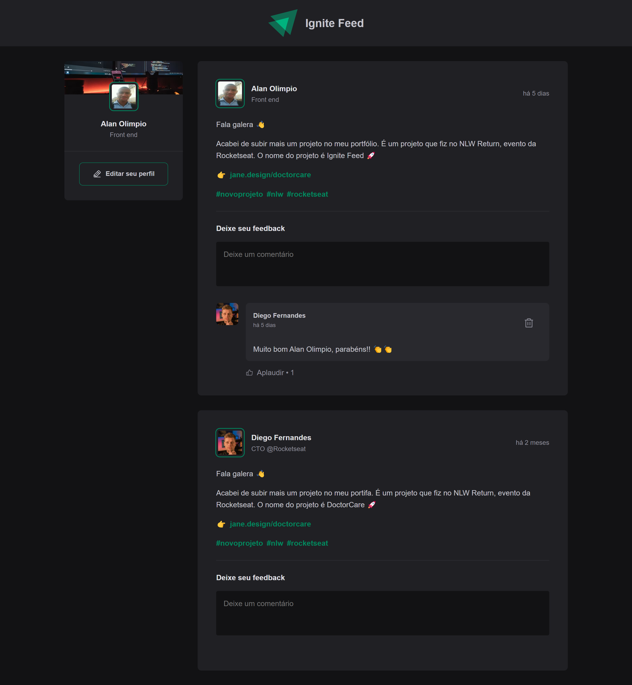
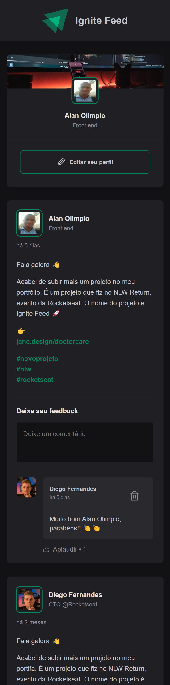

# Ignite Feed

Esse aplicativo foi desenvolvido no curso <a href="https://app.rocketseat.com.br/journey/react-js-2022/overview" target="_blank">ReactJS</a> , é aplicação React utilizando o Vite, e TypeScript.

|Desktop|Mobile|
|-------|------|
|||

## 🔨 Funcionalidades do projeto

Esse aplicativo exibe um feed onde é possível adicionar e excluir comentários. 

## ✔️ Técnicas e tecnologias utilizadas

Lista das bibliotecas utilizadas no desenvolvimento:

- `React`
- `react-dom`
- `Vite`
- `TypeScript`
- `date-fns`
- `phosphor-react`

## 🛠️ Abrir e rodar o projeto

Dentro da pasta do projeto execute npm i ou yarn para instalar as dependências e npm run dev ou yarn dev para iniciar o projeto.
